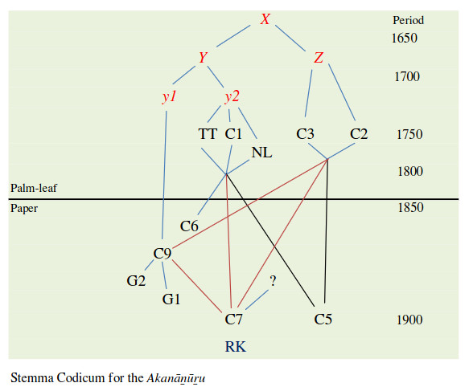
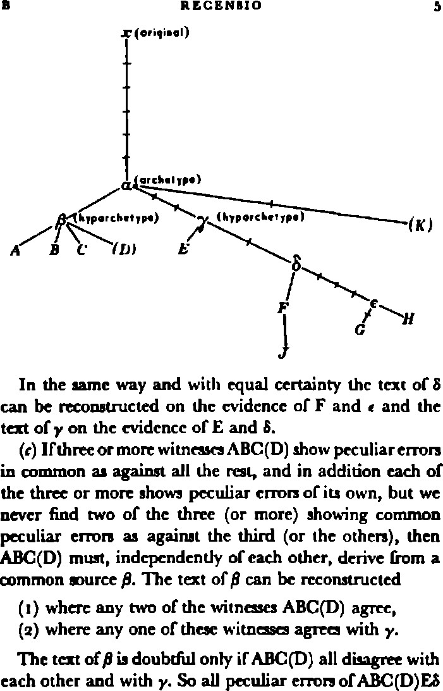

# Workshop 3, the one where we infer a stemma

In this third workshop, we will take our multiple-text alignment and look at algorithms for inferring a phylogenetic tree, which we will use as a stemma. Then, we will learn an algorithm for reconstructing a critical text based on that stemma.

## Eva's stemma (Wilden 2018, l)

## Lachmann's method (Maas 1958, 5)

### Resources

* [alignment of AN4](https://github.com/UHH-Tamilex/workshop/blob/main/stemma/AN4.xml)
* [matrix editor](https://chchch.github.io/sanskrit-alignment/matrix-editor)
* [SplitsTree 6](https://software-ab.cs.uni-tuebingen.de/download/splitstree6/welcome.html)
* [bibliography](bibliography.md)
